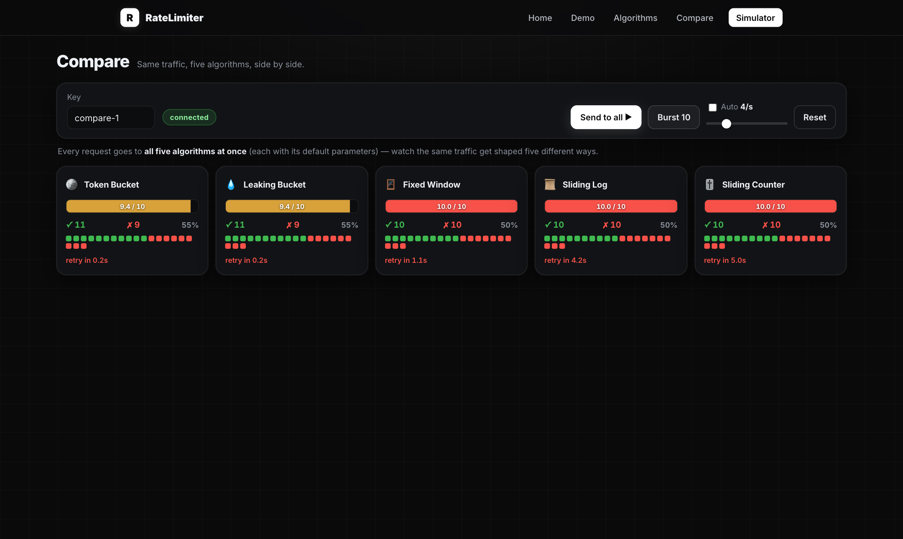
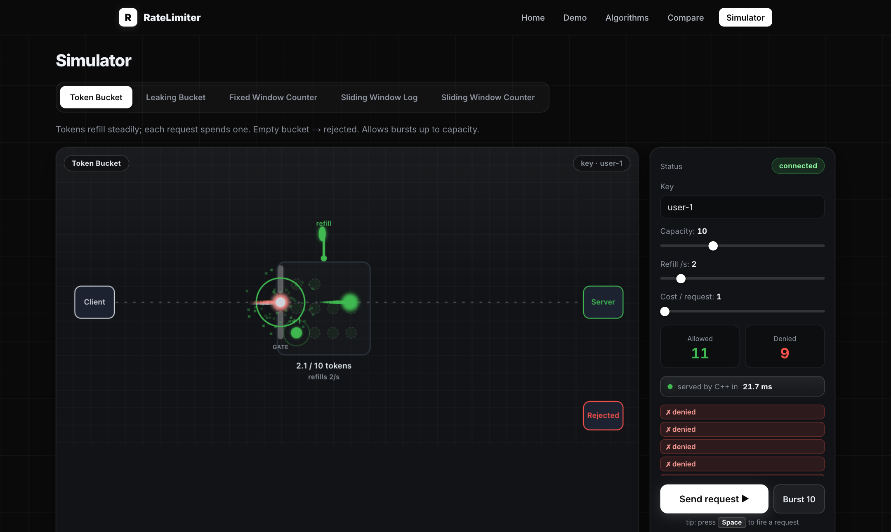

<div align="center">

# ⏱️ Rate Limiter

[](https://github.com/subhm2004/Rate_Limiter/actions/workflows/ci.yml)


### A full-stack, thread-safe rate limiter with five algorithms

**Node.js (Express) backend** whose algorithms are written in **C++** and loaded as a native **N-API addon** · **Next.js frontend** (animated simulator) · **One-command dev workflow** (`npm run dev`)

</div>

---

## Preview

|  |  |
|---|---|
|  |  |

**The simulator** — packets fly from the client to the gate, the C++ engine decides, and the
mechanism (tokens, water, windows) animates in real time:



---

## Table of Contents

1. [What is this?](#1-what-is-this)
2. [Why rate limiting?](#2-why-rate-limiting)
3. [Feature highlights](#3-feature-highlights)
4. [Architecture overview](#4-architecture-overview)
5. [Project structure](#5-project-structure)
6. [Prerequisites](#6-prerequisites)
7. [Quick start](#7-quick-start)
8. [npm scripts reference](#8-npm-scripts-reference)
9. [How `npm run dev` works](#9-how-npm-run-dev-works)
10. [The five algorithms in depth](#10-the-five-algorithms-in-depth)
    - [Token Bucket](#101-token-bucket)
    - [Leaking Bucket](#102-leaking-bucket)
    - [Fixed Window Counter](#103-fixed-window-counter)
    - [Sliding Window Log](#104-sliding-window-log)
    - [Sliding Window Counter](#105-sliding-window-counter)
    - [Side-by-side comparison](#106-side-by-side-comparison)
11. [The C++ library API](#11-the-c-library-api)
12. [The HTTP API](#12-the-http-api)
13. [The Next.js frontend](#13-the-nextjs-frontend)
14. [Configuration](#14-configuration)
15. [Concurrency & design notes](#15-concurrency--design-notes)
16. [Testing](#16-testing)
17. [Building for production](#17-building-for-production)
18. [Extending the project](#18-extending-the-project)
19. [Troubleshooting](#19-troubleshooting)
20. [FAQ](#20-faq)
21. [Roadmap](#21-roadmap)
22. [License](#22-license)

---

## 1. What is this?

This project is a **rate limiter** — a component that decides whether a given
request is allowed to proceed *right now*, or whether it should be throttled
(rejected or delayed) because too many requests have already happened in a
recent span of time.

It implements the **five algorithms** that show up again and again in system
design interviews and real production systems:

1. **Token Bucket**
2. **Leaking Bucket**
3. **Fixed Window Counter**
4. **Sliding Window Log**
5. **Sliding Window Counter**

The algorithm logic is written in **modern C++ (C++17)** as a small, header-only,
thread-safe library. A **Node.js (Express) server** loads that library as a
native **N-API addon** and exposes it over a JSON API — so you get a real Node
backend with the hot-path logic running as compiled C++. The **frontend is a
Next.js app** (React, App Router) — an animated simulator where you fire requests
at each algorithm and watch, in real time, how each one allows, throttles, and
recovers.

Everything is wired together with a single command: **`npm run dev`** builds the
C++ addon and starts both the Node backend and the Next.js dev server together.

---

## 2. Why rate limiting?

Rate limiting protects a system from being overwhelmed and enforces fair usage.
Common reasons to use it:

- **Protect backends from overload.** A burst of traffic — whether from a
  legitimate spike, a buggy client in a retry loop, or a deliberate attack —
  can exhaust CPU, memory, database connections, or downstream quotas. A rate
  limiter sheds load before that happens.
- **Enforce fair use / quotas.** "100 requests per minute per API key" keeps one
  noisy tenant from starving everyone else.
- **Control cost.** When each request costs money (a paid third-party API, an
  LLM token bill), limiting the rate caps the spend.
- **Mitigate abuse.** Throttling login attempts slows down brute-force and
  credential-stuffing attacks.
- **Smooth traffic.** Some downstreams need a steady, predictable inflow rather
  than spiky bursts; a limiter can shape traffic into a constant stream.

The hard part is that "too many requests" can be defined in several ways, and
each definition has different trade-offs in **accuracy**, **memory**, **burst
behaviour**, and **implementation complexity**. That is exactly why there are
five algorithms here — so you can *see* the differences instead of just reading
about them.

---

## 3. Feature highlights

- ✅ **Five algorithms**, each in its own small, readable C++ header.
- ✅ **Node server + C++ algorithms** — a real Express API whose decisions are made
  by compiled C++ loaded as an N-API native addon (the best of both worlds).
- ✅ **Thread-safe** — every limiter guards its state with a `std::mutex`, and the
  addon registry has its own lock. A stress test fires 200 concurrent requests at
  a single key and confirms the limit is never exceeded.
- ✅ **Cost-weighted requests** — each request can cost N units (a slider in the UI),
  handled natively by every algorithm.
- ✅ **Per-key isolation** — state is stored per key (user id, IP, API token…),
  so one client never affects another.
- ✅ **Monotonic time** — all timing uses `std::chrono::steady_clock`, immune to
  wall-clock / NTP adjustments.
- ✅ **Lean dependencies** — the C++ algorithms are header-only (standard library
  only); the addon bridge uses `node-addon-api`; the server uses Express.
- ✅ **Animated canvas simulator** — a Next.js (React + App Router) frontend where
  request packets fly to the gate and get allowed/rejected, and each algorithm's
  mechanism (token dots refilling, water leaking, windows sliding) animates in
  real time. Live parameter sliders, an auto-traffic generator, and a decision
  feed.
- ✅ **No CORS headaches** — Next.js proxies `/api/*` to the C++ backend via a
  rewrite, so the browser only ever talks to one origin.
- ✅ **Live throughput chart** — a real-time graph of allowed vs denied requests
  per second.
- ✅ **Built-in benchmark** — fire hundreds of requests at every algorithm and
  compare allow-rate, throughput and p99 latency in a results table.
- ✅ **C++ source viewer** — read the actual engine header for the selected
  algorithm, syntax-highlighted, served straight from the repo.
- ✅ **Real API semantics** — denials return **429** with `Retry-After`, and every
  response carries `X-RateLimit-*` headers.
- ✅ **CI** — GitHub Actions runs the C++ test suite, builds the native addon,
  smoke-tests the API and builds the frontend on every push.
- ✅ **Traffic presets + latency badge** — one-click Steady / Bursty / DDoS-spike
  load, and a “served by C++ in X ms” round-trip readout proving the real backend.
- ✅ **Runs with Docker** — `docker compose up` brings up both services; no local
  C++ / Node toolchain needed.
- ✅ **One-command dev** — `npm run dev` builds the backend, installs frontend
  deps on first run, and launches both servers with coloured, prefixed logs and
  clean shutdown.
- ✅ **Tested** — an assertion-based C++ test suite covers limits, time-based
  recovery, window resets, boundary accuracy, key independence, and concurrency.

---

## 4. Architecture overview

```
                   ┌───────────────────────────────────────────────┐
                   │                  npm run dev                    │
                   │            (scripts/dev.mjs, Node)              │
                   │  builds C++ addon, installs deps, runs both     │
                   └───────────────┬───────────────────┬────────────┘
                                   │                   │
                  spawns           │                   │   spawns
                                   ▼                   ▼
        ┌────────────────────────────────┐   ┌──────────────────────────────┐
        │   Next.js dev server :3000     │   │  Node (Express) backend :8080 │
        │   (React, App Router)          │   │        backend/server.js      │
        │                                │   │                               │
        │  browser loads the UI here     │   │  ┌─────────────────────────┐  │
        │                                │   │  │ Express routes /api/*   │  │
        │  /api/*  ──── rewrite ─────────┼──►│  │  meta/check/config/reset│  │
        │  (proxied to :8080, no CORS)   │   │  └───────────┬─────────────┘  │
        └────────────────────────────────┘   │              │ require()      │
                                              │  ┌───────────▼─────────────┐  │
                                              │  │ N-API addon (C++)       │  │
                                              │  │  ratelimiter.node       │  │
                                              │  │  Manager (mutex-guarded)│  │
                                              │  └───────────┬─────────────┘  │
                                              │  ┌───────────▼─────────────┐  │
                                              │  │  rate_limiter library   │  │
                                              │  │  9 algorithms, per-key  │  │
                                              │  │  state, mutex-guarded    │  │
                                              │  └─────────────────────────┘  │
                                              └──────────────────────────────┘
```

- The browser loads the UI from **http://localhost:3000** (Next.js).
- The Next.js app calls **relative** URLs like `/api/meta`. A rewrite in
  `frontend/next.config.mjs` forwards every `/api/*` request to the C++ backend
  at `http://localhost:8080`. Because the browser only ever sees one origin
  (`:3000`), there are no cross-origin (CORS) issues.
- The C++ backend is a pure JSON API server. (It can still serve static files,
  but in this setup Next.js owns the UI.)

---

## 5. Project structure

```
Rate_Limiter/
├── package.json                     # root npm scripts (dev / build / test / clean)
├── docker-compose.yml               # run backend + frontend with one command
│
├── scripts/
│   └── dev.mjs                      # builds backend + runs both servers together
│
├── backend/                         # Node server + C++ algorithms
│   ├── include/rate_limiter/        # header-only C++ algorithm library
│   │   ├── base.h                   #   RateLimiter interface + Decision struct
│   │   ├── token_bucket.h           #   1. Token Bucket
│   │   ├── leaking_bucket.h         #   2. Leaking Bucket
│   │   ├── fixed_window.h           #   3. Fixed Window Counter
│   │   ├── sliding_window_log.h     #   4. Sliding Window Log
│   │   └── sliding_window_counter.h #   5. Sliding Window Counter
│   ├── native/addon.cpp             # N-API bridge: C++ ↔ Node (Manager registry)
│   ├── binding.gyp                  # node-gyp build config for the addon
│   ├── server.js                    # Express API server (loads the addon)
│   ├── package.json                 # express / node-addon-api / node-gyp
│   ├── tests/tests.cpp              # C++ unit tests (no framework)
│   ├── Makefile                     # make test / make clean (C++ tests)
│   └── Dockerfile                   # backend image (Node + built addon)
│
├── frontend/                        # Next.js app (React, App Router)
│   ├── app/
│   │   ├── layout.js                #   root layout + metadata
│   │   ├── page.js                  #   page shell, renders the simulator
│   │   └── globals.css              #   dark theme + panel styling
│   ├── components/
│   │   └── Simulator.js             #   canvas simulator + control panel
│   ├── next.config.mjs              #   /api/* → backend rewrite (proxy)
│   ├── package.json                 #   next / react / react-dom
│   └── Dockerfile                   #   frontend image (Next.js production)
│
├── .gitignore
└── README.md                        # you are here
```

A note on the C++ headers: each algorithm lives in its own `.h` file and uses
classic `#ifndef / #define / #endif` include guards (for example `RL_BASE_H`),
not `#pragma once`. Every limiter is fully defined inline in its header, so the
library is **header-only** — there is nothing to compile or link separately; you
just `#include` what you need.

---

## 6. Prerequisites

You need:

| Tool          | Why                                   | Check                |
|---------------|---------------------------------------|----------------------|
| Node.js ≥ 18  | runs the Express backend + Next.js     | `node --version`     |
| npm           | installs deps, runs scripts            | `npm --version`      |
| A C++17 compiler (`clang++` or `g++`) | node-gyp builds the C++ addon | `c++ --version` |
| Python 3      | required by node-gyp                   | `python3 --version`  |
| `make`        | runs the C++ unit tests                | `make --version`     |

On macOS, `clang++` and `make` come with the Xcode Command Line Tools
(`xcode-select --install`). On Linux, install `build-essential` (Debian/Ubuntu)
or the `gcc`/`make` packages for your distro. Node can be installed from
[nodejs.org](https://nodejs.org) or your package manager.

You do **not** need to install anything manually — on the first run `npm run dev`
installs both the backend deps (which compiles the C++ addon via node-gyp) and
the frontend deps (Next.js / React) automatically.

---

## 7. Quick start

```bash
# from the project root
npm run dev
```

That single command:

1. Installs backend deps and compiles the C++ algorithms into a native addon
   (`npm install` in `backend/`, the first time).
2. Installs the frontend dependencies the first time (`npm install` in
   `frontend/`).
3. Starts the Node (Express) API server on **http://localhost:8080**.
4. Starts the Next.js dev server on **http://localhost:3000**.

Then open **http://localhost:3000** — you land on the home page; click **Launch the simulator** (or go straight to **/simulator**) and start firing requests. Press **Ctrl+C** to stop both servers cleanly.

> The first Next.js start can take a few seconds while it compiles. After that,
> hot reload is instant.

### Run with Docker (no local toolchain)

If you have Docker, you don't need a C++ compiler or Node installed locally:

```bash
docker compose up --build
```

This builds and starts both services — the C++ API and the Next.js app — then
open **http://localhost:3000**. Stop with Ctrl+C (or `docker compose down`).

### Run the tests

```bash
npm test          # equivalent to: make -C backend test
```

---

## 8. npm scripts reference

All scripts are defined in the root `package.json` and run from the project root.

| Script                   | What it does |
|--------------------------|--------------|
| `npm run dev`            | Build backend, install frontend deps (first run), run **both** servers together. The main entry point. |
| `npm run dev:clean`      | Same as `dev`, but first wipes the Next.js caches (`frontend/.next` + `node_modules/.cache`) — use when the UI serves stale/broken bundles. |
| `npm run build`          | Production build of **both**: compiles the backend and runs `next build`. |
| `npm run build:backend`  | Compile the C++ backend only. |
| `npm run build:frontend` | Install deps and run `next build` for the frontend only. |
| `npm run backend`        | Build and run only the C++ API server on :8080. |
| `npm run frontend`       | Run only the Next.js dev server on :3000 (expects the backend on :8080). |
| `npm run install:frontend` | Install the frontend npm dependencies. |
| `npm test`               | Build and run the C++ test suite. |
| `npm run clean`          | Remove `backend/build/` and `frontend/.next/`. |

---

## 9. How `npm run dev` works

`npm run dev` runs `scripts/dev.mjs`, a small Node script. Step by step:

1. **Build the addon if needed, fail fast.** If `backend/node_modules` is missing
   it runs `npm install --prefix backend` (which compiles the C++ addon via
   node-gyp); if only the `.node` binary is missing it rebuilds it. A failure
   prints a clear error and exits.
2. **Install frontend deps if missing.** If `frontend/node_modules` does not
   exist, it runs `npm install --prefix frontend` once.
3. **Spawn both servers.** It launches:
   - the Node backend: `node backend/server.js` (port 8080)
   - the Next.js dev server: `npm run dev` inside `frontend/` (with the
     `BACKEND_URL` env var pointing at the Node backend, which the rewrite uses).
4. **Prefix and colour logs.** Output from each child is tagged so you can tell
   them apart — `[backend]` in cyan, `[frontend]` in magenta.
5. **Tie their lifetimes together.** Pressing **Ctrl+C** sends `SIGINT` to both
   children and exits. If either server stops on its own, the script stops the
   other one too, so you never end up with a half-running setup.

The two ports are constants at the top of `scripts/dev.mjs`
(`BACKEND_PORT = 8080`, `FRONTEND_PORT = 3000`). The proxy target is passed to
Next.js as the `BACKEND_URL` environment variable.

---

## 10. The five algorithms in depth

Every algorithm answers the same question — *"is this request allowed?"* — but
defines "too many" differently. All of them implement the common interface in
`backend/include/rate_limiter/base.h` and return a `Decision`:

```cpp
struct Decision {
    bool   allowed;       // request permitted?
    double remaining;     // units still available right now
    double retry_after;   // seconds until it would be allowed (0 if allowed)
    double limit;         // configured ceiling
    double used;          // current load toward the limit (drives the gauge)
};
```

Throughout, *cost* is how many units one call consumes (default 1), and a *key*
is the identity the limit applies to (user, IP, token…).

---

### 10.1 Token Bucket

**Idea.** Imagine a bucket that holds up to `capacity` tokens. Tokens are added
at a steady `refill_rate` (tokens per second), up to the cap. Each request
removes `cost` tokens; if there are not enough, the request is rejected.

**Behaviour.** Allows short **bursts** — a client that has been quiet can spend
the whole bucket at once — while bounding the **long-run average** to
`refill_rate`. This is the most popular general-purpose choice.

**Parameters.** `capacity` (max burst size), `refill_rate` (steady tokens/sec).

**Pseudocode.**

```
on request(key, cost):
    bucket = state[key]  (starts full: tokens = capacity)
    elapsed = now - bucket.last_refill
    bucket.tokens = min(capacity, bucket.tokens + elapsed * refill_rate)
    bucket.last_refill = now
    if bucket.tokens >= cost:
        bucket.tokens -= cost
        return ALLOW
    else:
        retry_after = (cost - bucket.tokens) / refill_rate
        return DENY
```

**Memory.** O(1) per key (two numbers). **Pros:** burst-friendly, smooth average,
cheap. **Cons:** a sudden burst can briefly exceed the average rate (by design).

**Implementation:** `backend/include/rate_limiter/token_bucket.h`.

---

### 10.2 Leaking Bucket

**Idea.** Requests pour into a bucket (a queue) that **leaks** at a constant
`leak_rate` (units per second). The bucket holds at most `capacity` units; if a
new request would overflow it, the request is rejected.

**Behaviour.** Where the token bucket allows bursts, the leaking bucket
**smooths** them: the output is a steady, constant rate no matter how spiky the
input is. Think of it as enforcing a maximum *sustained* rate with a small buffer
for jitter.

**Parameters.** `capacity` (queue/buffer size), `leak_rate` (steady units/sec).

**Pseudocode.**

```
on request(key, cost):
    bucket = state[key]  (starts empty: level = 0)
    elapsed = now - bucket.last_leak
    bucket.level = max(0, bucket.level - elapsed * leak_rate)
    bucket.last_leak = now
    if bucket.level + cost <= capacity:
        bucket.level += cost
        return ALLOW
    else:
        overflow = bucket.level + cost - capacity
        retry_after = overflow / leak_rate
        return DENY
```

**Memory.** O(1) per key. **Pros:** produces a perfectly smooth outflow; great
for protecting a fragile downstream that wants a constant rate. **Cons:** less
forgiving of legitimate bursts than the token bucket.

> Token bucket vs leaking bucket, in one line: the **token bucket limits the
> average and tolerates bursts**, while the **leaking bucket enforces a smooth,
> constant rate**. They are duals of each other.

**Implementation:** `backend/include/rate_limiter/leaking_bucket.h`.

---

### 10.3 Fixed Window Counter

**Idea.** Chop time into fixed windows of `window` seconds (for example, every
calendar minute). Each window allows up to `limit` requests; the counter resets
when a new window begins.

**Behaviour.** Dead simple and very cheap. Its famous weakness is the
**boundary burst**: a client can send `limit` requests at the very end of one
window and `limit` more at the very start of the next, getting up to **2× the
limit** within a span shorter than one window.

**Parameters.** `limit` (requests per window), `window` (window length, seconds).

**Pseudocode.**

```
on request(key, cost):
    w = state[key]
    if w is new OR now - w.start >= window:
        w.start = floor(now / window) * window   # snap to a grid boundary
        w.count = 0
    if w.count + cost <= limit:
        w.count += cost
        return ALLOW
    else:
        retry_after = (w.start + window) - now
        return DENY
```

**Memory.** O(1) per key (a window start + a count). **Pros:** trivial to
implement, minimal memory, easy to reason about. **Cons:** the 2× boundary burst.

**Implementation:** `backend/include/rate_limiter/fixed_window.h`.

---

### 10.4 Sliding Window Log

**Idea.** Keep a **timestamp for every accepted request**. On each check, drop
the timestamps older than `window` seconds; if fewer than `limit` remain, accept
the request and append its timestamp.

**Behaviour.** **Perfectly accurate** — the limit is enforced over a true
rolling window, with no boundary burst. The trade-off is memory: it stores up to
`limit` timestamps per key.

**Parameters.** `limit` (requests per rolling window), `window` (seconds).

**Pseudocode.**

```
on request(key, cost):
    log = state[key]                 # a queue of timestamps
    while log not empty and log.front() <= now - window:
        log.pop_front()              # evict timestamps that slid out
    if log.size() + cost <= limit:
        push `now` onto log (cost times)
        return ALLOW
    else:
        retry_after = log.front() + window - now
        return DENY
```

**Memory.** O(limit) per key. **Pros:** exact; no edge-case bursts. **Cons:**
memory and work scale with the limit; expensive for very high limits.

**Implementation:** `backend/include/rate_limiter/sliding_window_log.h`.

---

### 10.5 Sliding Window Counter

**Idea.** A clever **approximation** of the sliding window log that uses only
**two counters** — the current fixed window and the previous one. It estimates
the rolling count by weighting the previous window by how much of it still
overlaps the sliding window:

```
estimated = current_count + previous_count * overlap_fraction
```

where `overlap_fraction = 1 - (elapsed_in_current_window / window)`.

**Behaviour.** Smooths out the fixed-window boundary burst while keeping **O(1)
memory**. The estimate assumes requests were spread evenly across the previous
window, so it can be slightly off in pathological cases — but in practice it is
very close to the exact log and is what many production systems actually use.

**Parameters.** `limit` (requests per rolling window), `window` (seconds).

**Pseudocode.**

```
on request(key, cost):
    s = state[key]                          # {window_start, current, previous}
    advance s to the window containing now  # current->previous on a 1-window step
    elapsed = now - s.window_start
    prev_weight = max(0, 1 - elapsed / window)
    estimated = s.previous * prev_weight + s.current
    if estimated + cost <= limit:
        s.current += cost
        return ALLOW
    else:
        return DENY
```

**Memory.** O(1) per key. **Pros:** near-exact accuracy at constant memory — the
best practical balance. **Cons:** an approximation, so not bit-perfect like the
log.

**Implementation:** `backend/include/rate_limiter/sliding_window_counter.h`.

---

### 10.6 Side-by-side comparison

| # | Algorithm | Parameters | Allows bursts? | Output shape | Memory / key | Boundary burst | Accuracy |
|---|-----------|------------|----------------|--------------|--------------|----------------|----------|
| 1 | **Token Bucket**            | capacity, refill/s | Yes (up to capacity) | bursty-but-bounded | O(1) | n/a | exact average |
| 2 | **Leaking Bucket**          | capacity, leak/s   | No (smooths)         | constant outflow   | O(1) | n/a | exact rate |
| 3 | **Fixed Window Counter**    | limit, window      | At edges             | steppy             | O(1) | up to **2×**   | coarse |
| 4 | **Sliding Window Log**      | limit, window      | No                   | exact rolling      | O(limit) | **none**   | exact |
| 5 | **Sliding Window Counter**  | limit, window      | No                   | smooth rolling     | O(1) | smoothed       | near-exact |

**Which one should I use?**

- **Token Bucket** — sensible default. Allows bursts, bounds the average.
- **Leaking Bucket** — when a downstream needs a smooth, constant rate.
- **Fixed Window Counter** — simplest and cheapest; fine when the edge burst is
  acceptable (e.g. coarse quotas).
- **Sliding Window Log** — when you need exact correctness and can afford O(limit)
  memory.
- **Sliding Window Counter** — the practical middle ground: near-exact accuracy
  at O(1) memory. A great production default for "N requests per window".

**See it for yourself:** in the playground, set every card's **Traffic** slider
to about 10/s with a limit of 10/5s. The buckets let a steady trickle through
forever, the fixed window allows a chunk and then hard-blocks until it resets,
and the sliding variants throttle more evenly.

---

## 11. The C++ library API

The algorithms are a header-only C++ library — this is exactly what the Node
backend loads (via the N-API addon), and you can also drop `backend/include/` on
your include path to use it in any C++ project:

```cpp
#include "rate_limiter/token_bucket.h"
#include <iostream>

int main() {
    rl::TokenBucket limiter(/*capacity=*/10, /*refill_rate=*/2);  // 2 req/s, burst 10

    rl::Decision d = limiter.allow("user-42");      // cost defaults to 1
    if (d.allowed) {
        // ... serve the request ...
    } else {
        std::cout << "throttled; retry after " << d.retry_after << "s\n";
    }

    // Consume more than one unit at once:
    rl::Decision big = limiter.allow("user-42", /*cost=*/5);
}
```

Every algorithm exposes the same call:

```cpp
Decision allow(const std::string& key, int cost = 1);
```

and the same `Decision` fields described in [section 10](#10-the-five-algorithms-in-depth).
Constructors differ only in their parameters:

```cpp
rl::TokenBucket            tb(capacity, refill_rate);
rl::LeakingBucket          lb(capacity, leak_rate);
rl::FixedWindowCounter     fw(limit, window);
rl::SlidingWindowLog       sl(limit, window);
rl::SlidingWindowCounter   sc(limit, window);
```

Constructors validate their arguments and throw `std::invalid_argument` if a
parameter is not positive. `allow()` is safe to call from multiple threads on the
same instance.

---

## 12. The HTTP API

The Node (Express) server speaks JSON over plain `GET` requests (so everything is easy to
`curl` or open in a browser). In development you can reach it two ways:

- directly at `http://localhost:8080/api/...`
- through the Next.js proxy at `http://localhost:3000/api/...` (same responses)

| Endpoint | Purpose |
|----------|---------|
| `GET /api/meta` | List the algorithms and their current configuration (the frontend uses this to build the UI). |
| `GET /api/check?algo=<id>&key=<k>&cost=<n>` | Run one request through an algorithm; returns a `Decision` as JSON. `cost` defaults to 1. |
| `GET /api/config?algo=<id>&p1=<a>&p2=<b>` | Reconfigure one algorithm (clears that algorithm's state). |
| `GET /api/reset` | Clear all per-key state across every algorithm. |
| `GET /api/source?algo=<id>` | The actual C++ header implementing that algorithm (powers the UI's source viewer). |

**Real-world response semantics.** `/api/check` behaves like a production API:
allowed requests return **200**, denied ones return **429 Too Many Requests**, and
every response carries standard headers — `X-RateLimit-Limit`,
`X-RateLimit-Remaining`, and `Retry-After` (on 429):

```bash
curl -sD - "http://localhost:8080/api/check?algo=token_bucket&key=demo" -o /dev/null
# HTTP/1.1 200 OK
# X-RateLimit-Limit: 10
# X-RateLimit-Remaining: 9
# ...after the bucket is drained:
# HTTP/1.1 429 Too Many Requests
# Retry-After: 1
```

`algo` is one of: `token_bucket`, `leaking_bucket`, `fixed_window`,
`sliding_window_log`, `sliding_window_counter`.

**Examples.**

```bash
# Fire 12 requests at a capacity-10 token bucket -> 10 allowed, 2 denied
for i in $(seq 1 12); do
  curl -s "http://localhost:8080/api/check?algo=token_bucket&key=demo" \
    | grep -o '"allowed":[a-z]*'
done

# Inspect a single decision
curl -s "http://localhost:8080/api/check?algo=sliding_window_counter&key=alice"
# {"algo":"sliding_window_counter","allowed":true,"remaining":9.0000,
#  "retry_after":0.0000,"limit":10.0000,"used":1.0000}

# Reconfigure the fixed window to 5 requests / 2 seconds (this clears its state)
curl -s "http://localhost:8080/api/config?algo=fixed_window&p1=5&p2=2"

# Wipe all state
curl -s "http://localhost:8080/api/reset"
```

Inside the addon, an algorithm **registry** (the `Manager` class in
`backend/native/addon.cpp`) owns one limiter instance per algorithm plus the
parameters it was built with, so `/api/config` can rebuild a single limiter and
`/api/reset` can rebuild them all.

---

## 13. The Next.js frontend

The UI is a Next.js app (App Router) under `frontend/`. Open the dev server at
**http://localhost:3000** — it is an **animated canvas simulator**, not a static
dashboard.

**The stage.** A request *packet* leaves the **Client** on the left, travels to
the limiter **gate** in the middle, and then either continues to the **Server**
(allowed, green) or veers off to the **Rejected** bin (red). Every decision is
made by the real C++ backend; the animation just visualises it.

**The mechanism animates per algorithm, in real time:**

- **Token Bucket** — a bucket of token dots that visibly refills from a drip pipe
  at the configured rate; each allowed request consumes a token.
- **Leaking Bucket** — a water tank that fills when requests arrive and leaks
  steadily from the bottom; requests that would overflow bounce off.
- **Fixed Window Counter** — a counter column plus a circular dial counting down
  to the next window reset (with a flash when it resets to zero).
- **Sliding Window Log** — a timeline where each request drops a tick that slides
  left and falls out of the window as time passes.
- **Sliding Window Counter** — the previous and current window bars side by side,
  with the previous one weighted by its live overlap, and the estimated total.

**The side panel** has: the **Key** (per-user identity), **sliders** for the two
algorithm parameters (which reconfigure the backend live), **Allowed/Denied**
counters, a **“served by C++ in X ms”** latency badge, a **feed** of recent
decisions, **Send request** / **Burst 10**, an **Auto traffic** toggle, and
**traffic presets** (Steady / Bursty / DDoS spike).

**Below the stage**, a **Live throughput** chart plots allowed vs denied requests
per second in real time, so you can watch a preset's load shape itself.

**How the code is laid out:**

- `app/page.js` — the page shell; renders the `<Simulator/>`.
- `components/Simulator.js` — the whole simulator: a `<canvas>` driven by a
  `requestAnimationFrame` loop (packets, pulses, and the per-algorithm mechanism)
  plus the React control panel. It calls the backend for each decision and
  *snaps* the visual mechanism to the backend's reported state on every response.
- `app/globals.css` — the dark theme and panel styling.
- `next.config.mjs` — the `/api/*` → backend rewrite (the proxy).

Because all API calls are **relative** (`/api/...`) and Next.js proxies them to
the backend, the components never hard-code a backend host and there are no CORS
issues.

---

## 14. Configuration

| What | Where | Notes |
|------|-------|-------|
| Backend port | `scripts/dev.mjs` (`BACKEND_PORT`) and the `backend` npm script | Default 8080. |
| Frontend port | `scripts/dev.mjs` (`FRONTEND_PORT`) and `frontend/package.json` (`next dev -p 3000`) | Default 3000. |
| API proxy target | `frontend/next.config.mjs` (reads `BACKEND_URL`, defaults to `http://localhost:8080`) | `npm run dev` sets `BACKEND_URL` automatically. |
| Default algorithm parameters | `Manager` constructor in `backend/native/addon.cpp` | The initial capacity / limit / window for each algorithm. |
| Compiler / flags | `backend/Makefile` (`CXX`, `CXXFLAGS`) | C++17, `-O2 -Wall -Wextra -pthread` by default. |

You can also run the Node backend directly on a custom port:

```bash
PORT=9000 node backend/server.js
```

If you change the backend port, set `BACKEND_URL` so the proxy follows:

```bash
BACKEND_URL=http://localhost:9000 npm run frontend
```

---

## 15. Concurrency & design notes

- **Locking.** Each `RateLimiter` instance owns a `std::mutex`. The public
  `allow()` method takes the lock, reads the monotonic clock, and calls the
  algorithm's `check()` while holding it. So all read-modify-writes of per-key
  state are atomic with respect to other threads.
- **Node ↔ C++ bridge.** Express calls into the C++ addon synchronously on the
  event loop, and the addon's `Manager` guards its registry with its own
  `std::mutex` — so even if you call it from Node worker threads, it's safe.
- **Monotonic time.** Timing uses `std::chrono::steady_clock` (via
  `now_seconds()` in `base.h`). Unlike the wall clock, it never jumps backwards
  due to NTP or DST, so windows and refills behave correctly.
- **Per-key state.** Each algorithm keeps an `unordered_map<key, state>`. Keys
  are completely independent. (Note: this map grows as new keys appear; see
  [Roadmap](#21-roadmap) for eviction of idle keys.)
- **Security note.** This is a **local development / educational tool** — the API
  is unauthenticated and not hardened for public exposure (no TLS, no auth).

---

## 16. Testing

The backend ships with an assertion-based test program (no test framework, to
keep dependencies at zero): `backend/tests/tests.cpp`.

```bash
npm test
# or:
cd backend && make test
```

It covers, for the relevant algorithms:

- **Burst limits** — exactly `capacity` / `limit` requests are allowed before
  rejection.
- **Time-based recovery** — token bucket refill and leaking bucket drain over
  time.
- **Window reset** — the fixed window allows again after the window rolls.
- **Boundary accuracy** — the sliding window log does *not* allow a boundary
  burst, and recovers as the oldest timestamp slides out.
- **Sliding counter recovery** — state fully resets after enough windows pass.
- **Key independence** — exhausting one key does not affect another.
- **Thread safety** — 200 concurrent requests against one key never let more than
  the limit through.

Expected output:

```
token_bucket       ok
leaking_bucket     ok
fixed_window       ok
sliding_log        ok
sliding_counter    ok
keys_independent   ok
thread_safety      ok

19 checks passed, 0 test(s) failed
```

---

## 17. Building for production

```bash
npm run build
```

This builds the C++ addon (optimised) and runs `next build` to produce an
optimised frontend. To run the production build:

```bash
# terminal 1 — Node backend (API)
node backend/server.js            # PORT=8080 by default

# terminal 2 — frontend
npm run start --prefix frontend   # serves the built Next.js app on :3000
```

Or just use Docker: `docker compose up --build` (see [Quick start](#7-quick-start)).
For a real deployment you'd run the Node backend behind a process manager and
serve the Next.js app from a Node host, with the `/api/*` rewrite pointing at the
backend's public URL via `BACKEND_URL`.

---

## 18. Extending the project

**Add a new algorithm.**

1. Create `backend/include/rate_limiter/my_algo.h` with an include guard and a
   class deriving from `rl::RateLimiter`. Implement `name()` and `check()`.
2. Include it in `backend/native/addon.cpp` and register it in the `Manager`
   constructor's `infos_` list (id, title, description, parameter labels and
   defaults) plus a branch in `Manager::build()`. Rebuild: `npm run build --prefix backend`.
3. Add a case to `backend/tests/tests.cpp`.
4. Add it to the `ALGOS` (and `EXPLAIN`) list in `frontend/components/Simulator.js`,
   and a `draw…` function for its animation.

**Use a different cost per request.** Pass `cost` to `allow()` (C++) or the
`cost` query parameter (HTTP) — useful when some requests are "heavier" than
others.

**Embed the library in your own service.** Ignore the server entirely and just
`#include` the headers; the limiters have no dependencies beyond the standard
library.

---

## 19. Troubleshooting

**`npm run dev` says the backend build failed.**
You are missing a C++17 compiler or `make`. Install the Xcode Command Line Tools
(`xcode-select --install`) on macOS, or `build-essential` on Debian/Ubuntu.

**"Address already in use" / a port is busy.**
Another process (often a previous run that did not shut down) is holding 8080 or
3000. Find and stop it:

```bash
lsof -nP -iTCP:8080 -sTCP:LISTEN     # see what's on 8080
pkill -f 'backend/server.js'         # stop stray backend servers
pkill -f next                        # stop stray Next.js servers
```

Then run `npm run dev` again.

**The UI shows "offline" / API calls fail.**
The backend on :8080 is not running or not reachable. Make sure `npm run dev` is
running and check the `[backend]` logs in the terminal. If you changed the
backend port, set `BACKEND_URL` (see [Configuration](#14-configuration)) so the
Next.js proxy points at the right place.

**Frontend deps look broken / weird errors after pulling changes.**
Reinstall them: `rm -rf frontend/node_modules && npm run install:frontend`.

**Changes to a `.h` file don't seem to take effect.**
The C++ is compiled into the native addon, so rebuild it:
`npm run build --prefix backend` (node-gyp recompiles the addon). If in doubt,
`npm run clean && npm run build:backend`. (`npm test` recompiles the C++ unit
tests separately via `make`.)

---

## 20. FAQ

**Why a Node server with C++ algorithms (instead of pure C++ or pure Node)?**
Rate limiting is a hot path — the decision runs on every request — so the logic
lives in C++ for tiny, predictable per-request cost. But a real service wants the
ergonomics of a Node/Express API (routing, middleware, ecosystem). Loading the
C++ as an **N-API native addon** gives both: an idiomatic Node server whose
decisions are made by compiled C++. The same headers are also unit-tested
directly in C++.

**Why Next.js for the frontend?**
It gives a modern React component model, fast hot reload during development, and a
built-in dev-server proxy (rewrites) that removes CORS friction — the browser
talks to one origin and Next forwards API calls to the Node backend.

**Do I have to install anything manually?**
No. `npm run dev` builds the backend and installs the frontend dependencies for
you on the first run.

**Is this distributed / multi-process safe?**
No. State lives in memory inside a single backend process. Two server instances
would not share counters. For a distributed limiter you would back the state with
something like Redis (see [Roadmap](#21-roadmap)) — but the algorithm logic would
be the same.

**Why `#ifndef` guards instead of `#pragma once` in the C++ headers?**
By request, and because classic include guards are universally portable and make
the intended single-inclusion behaviour explicit.

**Can I use just one algorithm in my own code?**
Yes — the headers are independent (each only pulls in `base.h`). Include the one
you want and ignore the rest.

---

## 21. Roadmap

Ideas for where this could go next:

- **Distributed state** via Redis (atomic Lua scripts) so multiple instances
  share limits.
- **Idle-key eviction** (TTL / LRU) so the per-key maps don't grow unbounded.
- **Standard rate-limit headers** (`X-RateLimit-Limit`, `-Remaining`, `-Reset`,
  `Retry-After`) in API responses.
- **A real middleware** wrapper (e.g. Next.js Route Handlers or an HTTP
  framework) showing the limiter guarding actual endpoints.
- **Live traffic charts** in the frontend (requests/sec over time per algorithm).
- **Benchmarks** comparing throughput and memory across the five algorithms.

---

## 22. License

MIT. See the root `package.json`. Use it, learn from it, build on it.

---

<div align="center">

Built as a hands-on way to *see* how rate limiting actually works.
Run `npm run dev` and open http://localhost:3000. 🚀

</div>
